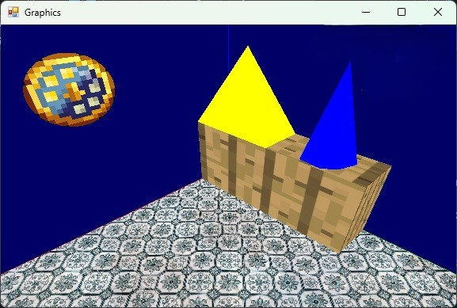

# CG Assignment

This project is a simple 3D scene renderer using OpenGL in C#. It demonstrates various 3D drawing primitives and transformations to render a scene consisting of a cube, pyramid, clock, cone, and ground. The scene features self-animation (the cone rotates automatically) as well as keyboard controls for translating and scaling the cube, pyramid, and cone.

## Features

- **Primitives & Shapes:**  
  Uses basic primitives such as lines, quads, triangles, triangle fans/strips, and polygons to render shapes like cubes, pyramids, clocks, cones, and ground planes.
  
- **Textures & Colors:**  
  Textures are applied to the ground, cube, and clock. Specific colors are used for the pyramid and cone.

- **Transformations:**  
  The project applies translation, scaling, and rotation transformations.  
  - **Self Animation:** The cone rotates continuously.
  - **User Input:** Keyboard controls allow for translation and scaling of the cube, pyramid, and cone.

- **Shaders:**  
  Custom vertex and fragment shaders are used to transform and color the scene objects.

## Usage:
- **Scene Navigation:**
The application displays a 3D scene with various objects.
- **Animation:**
The cone rotates continuously.
- **Controls:**
Use keyboard input to translate and scale the cube, pyramid, and cone.

## Final Scene Snapshot
Below is a snapshot of the final scene:

